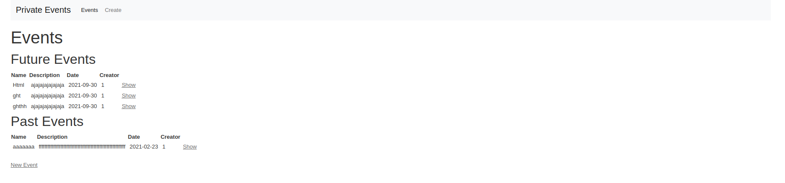

# ClubHouse
This project is a Private Events app. The idea is to create an app where the members of the website can publish events, attend events and invite other users.

## App Home Page

## Getting Started :
- Clone the repository: `git clone https://github.com/widzthedvloper/private-events`
- Move inside the club-house folder: `cd private-events`
- Run: `rails db:create` and `rails db:migrate`.
- Run the server: `rails s` or `rails server`
- To see the app on your local machine open your browser and type: `http://localhost:3000`. Have fun !!!

## BUILT WITH
  -HTML
  -CSS
  -bootstrap
  -Ruby
  -Ruby on Rails

##  AUTHORS

👤 **Widzmarc Jean Nesly Phelle**

- GitHub: [@widzthedvloper](https://github.com/widzthedvloper)
- Twitter: [@widzthedvloper](https://twitter.com/widzthedvloper)
- LinkedIn: [@widzthedvloper](https://www.linkedin.com/in/widzmarc-jean-nesly-phelle-252a26129/)

👤 **Oever González**

- GitHub: [@NoTengoBattery](https://github.com/NoTengoBattery)
- Twitter: [@NoTengoBattery](https://twitter.com/NoTengoBattery)
- LinkedIn: [@notengobattery](https://www.linkedin.com/in/notengobattery/)

## SHOW YOUR SUPPORT
Give a :star: if you like this project!

## 📝 LICENSE
This project is [MIT](/LICENSE) licensed.
